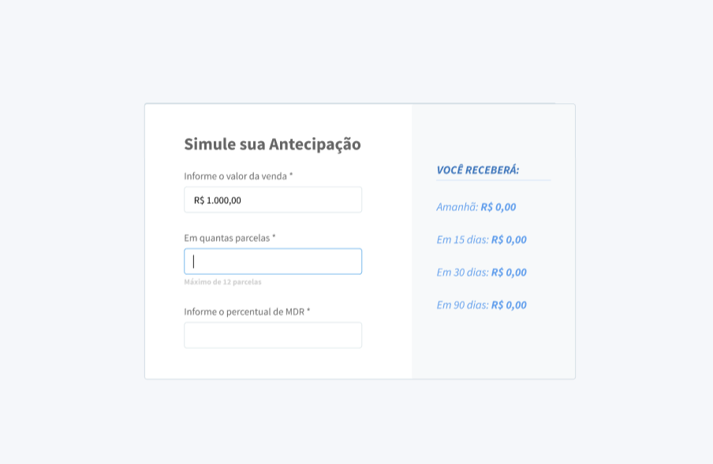

# Calculator
simple app, for a front-end technical interview

# ENG

This was a simple assignment, in order to simulate a technical interview. 
I was provided with an image of how the app should look like, what it should accomplish, and an API ready to use. 

This was the desired outcome:

